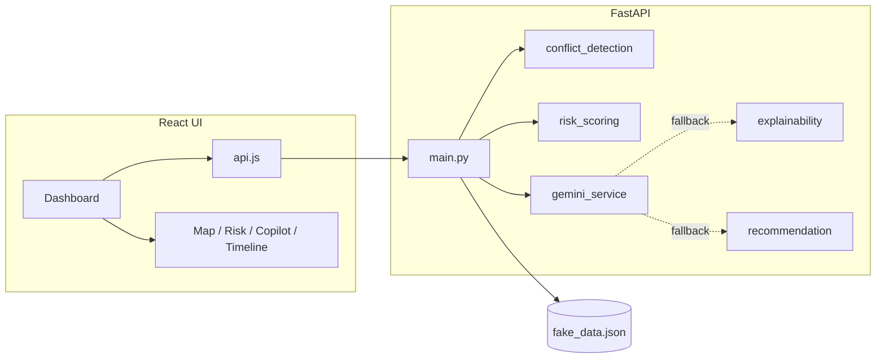

# Excavation Risk Assessment Digital Twin POC

This project is a local Proof of Concept for an AI-assisted Excavation Risk Assessment Digital Twin. It lets an analyst enter excavation location and work details, then returns a deterministic spatial and temporal risk assessment with a premium operational dashboard, a Leaflet + OpenStreetMap neighborhood map for An Narjis District, Riyadh, bilingual English/Arabic UI, explainable factors, and mitigation recommendations.

**POC transparency note:** This POC uses synthetic data and rule-based risk scoring. Results are for demonstration and workflow validation only, not calibrated operational decisions.

Arabic transparency note:

```text
يستخدم هذا النموذج التجريبي بيانات افتراضية وتقييم مخاطر مبني على قواعد. النتائج مخصصة للعرض والتحقق من سير العمل فقط، وليست قرارات تشغيلية معايرة.
```

All infrastructure, projects, incidents, conflicts, and risk overlays are synthetic. The map uses Leaflet + OpenStreetMap tiles, so no Google Maps API key is required. The An Narjis District, Riyadh boundary is manually configured using the provided coordinates. Real infrastructure data would require official APIs or datasets in a future production version.

---

## 1. What The System Does

The platform answers one operational question:

> If excavation work is planned at this location, depth, radius, and schedule, how risky is it and why?

It demonstrates:

- Manual excavation input using WGS84-style coordinate fields.
- Synthetic nearby infrastructure and project context generated around the submitted location.
- Spatial conflict detection against utilities and project zones.
- Temporal conflict detection against overlapping project schedules.
- Rule-based 0-100 risk scoring.
- Low / Medium / High risk classification.
- Confidence scoring and contributing factor breakdown.
- Analyst explanation and recommendations.
- Optional Google Gemini language enhancement for narrative and recommendations only.
- Leaflet + OpenStreetMap neighborhood map for An Narjis District, Riyadh with a manually configured boundary, popups, filters, and synthetic local risk overlays.
- Full English / Arabic UI with RTL support.

---

## 2. Current User Flow

1. The analyst opens the React dashboard.
2. The dashboard loads synthetic infrastructure, projects, incidents, and portfolio summary data from FastAPI.
3. The analyst enters:
   - Longitude
   - Latitude
   - Excavation depth
   - Work radius
   - Start date
   - End date
4. The analyst clicks **Analyze location risk**.
5. The frontend sends `POST /analyze-location` to the backend.
6. The backend generates a local synthetic context around the submitted location.
7. The backend runs deterministic spatial, temporal, scoring, confidence, and factor logic.
8. For this path, analyst **explanation** and **recommendations** are assembled **deterministically** in `location_analysis.py` (English and Arabic templates). **Gemini is not called** for `POST /analyze-location`. (Gemini applies only to `POST /analyze/{excavation_id}`; see **§3.1 AI stack** below.)
9. The frontend updates:
   - risk score card
   - location status card
   - operational status indicator
   - internal digital twin map
   - infrastructure/project overlaps
   - AI analyst assistant
   - explanation
   - recommendations
   - live operational event stream
   - risk timeline simulation
   - what changed summary

The map updates only after submit, using the latest successful analysis response as the source of truth.

---

## 3. Hybrid AI Architecture

The project uses a hybrid rule-based + generative AI design.

The rule engine is the source of truth for:

- conflict detection
- spatial overlap logic
- temporal overlap logic
- risk score
- risk level
- confidence score
- contributing factors
- map context returned to the frontend

The Gemini / LLM layer, if configured, is used only to improve natural-language output:

- analyst-style explanation wording
- professional recommendation wording

The system does **not** rely on the LLM for risk calculation. If Gemini is unavailable, missing an API key, rate-limited, or returns invalid output, the deterministic explanation and recommendation engines are used.

This makes the POC stable for offline demos and keeps the scoring path auditable.

### 3.1 AI stack: what we use (libraries and configuration)

| Piece | What we use | Role |
|--------|-------------|------|
| **Generative LLM (optional)** | **Google Gemini** via the **`google-generativeai`** Python package (`requirements.txt`, pinned **0.8.3**) | Rewrites **analyst explanation** and **recommendation list** into polished language **only** when the **excavation-ID** analysis path runs and Gemini is configured and healthy. |
| **Config / secrets** | **`python-dotenv`** loads `backend/.env` | Supplies `GEMINI_API_KEY`, optional `GEMINI_MODEL_NAME` (default **`gemini-2.5-flash`** in code), optional `GEMINI_MAX_RETRIES` (default **2**), and optional `GEMINI_DISABLED` (`1` / `true` / `yes` forces “disabled” status without calling the API). |
| **Risk and conflicts (not AI)** | Pure Python in **`services/conflict_detection.py`**, **`services/risk_scoring.py`**, and (for manual coordinates) **`services/location_analysis.py`** | All geometry, overlap rules, 0–100 score, Low/Medium/High band, confidence, and contributing factors are **deterministic**. |
| **Fallback language (not LLM)** | **`services/explainability.py`** and **`services/recommendation.py`** | When Gemini is unavailable or returns unusable output on the **excavation-ID** path, these modules build **structured explanation text** and **prioritized `RecommendationItem` rows** from the same rule-engine facts. |
| **Manual-location narrative (not LLM)** | **`services/location_analysis.py`** (`_build_location_explanation` / `_build_location_recommendations` and helpers) | For **`POST /analyze-location`**, explanation and recommendations are **template-generated** in **English** or **Arabic** from overlaps and risk; **no** `google-generativeai` call. |
| **Narrative layer status (diagnostic only)** | **`services/gemini_service.narrative_layer_status()`** and **`GET /ai-narrative-status`** | Reports whether Gemini *would* be considered active, disabled, or in fallback (key present, SDK installed, `GEMINI_DISABLED` off). **Does not invoke** the Gemini API. |

**Not used in this repo:** OpenAI, Anthropic, Azure OpenAI, LangChain, vector databases, RAG, or fine-tuned models. The only external model integration is **Gemini** through **`google-generativeai`**.

### 3.2 Gemini service (`backend/services/gemini_service.py`)

- **`generate_explanation(excavation, conflicts, risk)`** — Sends a **JSON-only** prompt built from **`_compact_context`** (excavation, conflicts, risk with trimmed factor details). Expects a JSON object with fixed analyst sections; validates required keys; raises **`GeminiServiceError`** if the response is empty or invalid.
- **`generate_recommendations(excavation, conflicts, risk)`** — Same pattern: JSON array of recommendations; validated against **`RecommendationItem`** (including minimum count and allowed action vocabulary / aliases).
- **Retries** — Up to **`GEMINI_MAX_RETRIES`** attempts on transient failures.
- **In-process caching** — SHA-256 keys over model name + serialized context reduce repeat calls for identical inputs during demos (`_TEXT_CACHE`, `_RECOMMENDATION_CACHE`).
- **SDK usage** — `genai.configure(api_key=...)` then `genai.GenerativeModel(MODEL_NAME)`; generation requests ask for **JSON-shaped** completions which are parsed after optional markdown fence stripping (`_strip_json_fence`).

### 3.3 Where Gemini runs in the API (`backend/main.py`)

| Endpoint | Conflicts / risk | Explanation & recommendations |
|----------|------------------|------------------------------|
| **`POST /analyze/{excavation_id}`** | `detect_conflicts` → `compute_risk` | **Try Gemini first** (`generate_explanation`, `generate_recommendations`). On **`GeminiServiceError`** or any unexpected error → **`build_explanation`** + **`recommend`**. |
| **`POST /analyze-location`** | Logic inside **`analyze_manual_location`** (synthetic local context + overlap/scoring) | **Always deterministic** strings and lists from **`location_analysis.py`** — **no** Gemini branch in `main.py`. |

The **React dashboard** shipped with this POC uses **`/analyze-location`**, so day-to-day UI behavior is **fully offline-capable** for narrative and actions without any Gemini key. Enabling Gemini still benefits anyone calling **`/analyze/{excavation_id}`** (e.g. Swagger, integrations, or future UI).

### 3.4 Frontend: “AI” labeling vs real models

- **No LLM runs in the browser.** The UI is React + Vite; it only displays API payloads.
- **`AiCopilotPanel.jsx`** — Marketing-style **“AI analyst assistant”** card: it **summarizes** deterministic API fields (top contributing factor, confidence band text, high-severity conflict count, first recommendation). It does **not** call an LLM.
- **`AnalysisPipeline.jsx`** — **Cosmetic progress animation** while waiting for the network; labels mention pipeline steps but do not execute ML.
- **`ExplanationPanel.jsx`** / **`RecommendationPanel.jsx`** — Render text and structured rows returned by the backend.

### 3.5 Tests and CI

- **`backend/tests/`** — Offline tests (e.g. **`test_location_analysis.py`**) exercise the **rule engine** and manual location behavior; they **do not** call Gemini or require **`GEMINI_API_KEY`**.

---

## 4. Tech Stack

### Backend

- Python
- FastAPI
- Pydantic
- Local JSON data store
- `python-dotenv`
- Optional `google-generativeai`
- Pytest for lightweight offline rule-engine tests

### Frontend

- React
- Vite
- Custom CSS
- Leaflet + React-Leaflet map rendering
- OpenStreetMap tile layer

### Data

- Fully synthetic
- In-memory loaded from `backend/data/fake_data.json`
- Regeneratable through API and UI
- Synthetic infrastructure/risk context generated locally for POC purposes

---

## 5. Repository Structure

```text
POC RIPC/
├── README.md
├── backend/
│   ├── main.py
│   ├── models.py
│   ├── data_generator.py
│   ├── requirements.txt
│   ├── .env
│   ├── data/
│   │   └── fake_data.json
│   ├── services/
│   │   ├── conflict_detection.py
│   │   ├── risk_scoring.py
│   │   ├── explainability.py
│   │   ├── recommendation.py
│   │   ├── gemini_service.py
│   │   └── location_analysis.py
│   └── tests/
│       ├── conftest.py
│       └── test_location_analysis.py
└── frontend/
    ├── package.json
    ├── vite.config.js
    ├── index.html
    └── src/
        ├── api.js
        ├── App.jsx
        ├── main.jsx
        ├── index.css
        ├── i18n.js
        ├── riskTheme.js
        ├── neighborhoodConfig.js
        └── components/
            ├── Dashboard.jsx
            ├── MapView.jsx
            ├── RiskCard.jsx
            ├── FactorChart.jsx
            ├── AiCopilotPanel.jsx
            ├── AnalysisPipeline.jsx
            ├── ExplanationPanel.jsx
            └── RecommendationPanel.jsx
```

---

## 6. Backend Overview

### `backend/main.py`

FastAPI entry point.

Responsibilities:

- Create the FastAPI app.
- Configure CORS for local frontend development.
- Load or generate the synthetic data store.
- Expose REST API endpoints.
- Orchestrate the analysis pipeline.
- Track last analysis time for dashboard summary.

Important endpoints:

```text
GET  /health
GET  /infrastructure
GET  /projects
GET  /incidents
GET  /dashboard-summary
POST /generate-data?seed=123
POST /analyze/{excavation_id}
POST /analyze-location
```

`POST /analyze/{excavation_id}` remains for the original generated excavation workflow.

`POST /analyze-location` is the current primary dashboard workflow.

---

## 7. Manual Location Analysis Endpoint

### Request

```http
POST /analyze-location
```

Body:

```json
{
  "longitude": 46.676244,
  "latitude": 24.828315,
  "depth": 4.85,
  "work_radius": 17.6,
  "start_date": "2026-05-12",
  "end_date": "2026-06-19",
  "language": "en"
}
```

Arabic can be requested with:

```json
{
  "language": "ar"
}
```

or:

```http
POST /analyze-location?lang=ar
```

### Response

The response includes:

- submitted input
- `risk_score`
- `risk_level`
- localized `risk_level_label`
- `is_risky`
- conflicts
- infrastructure overlaps
- project overlaps
- temporal overlaps
- explanation
- recommendations
- confidence score
- contributing factors
- `context_infrastructure`
- `context_projects`
- `context_incidents`
- `neighborhood_context` with:
  - `name`: `An Narjis District, Riyadh`
  - `name_ar`: `حي النرجس، الرياض`
  - `is_inside_demo_area`
  - manually configured boundary coordinates

The frontend uses this response as the single source of truth for the dashboard and map.

---

## 8. Synthetic Local Context

The manual analysis service generates or repositions nearby synthetic context relative to each submitted coordinate. For this POC, generated infrastructure, project zones, and incidents are constrained to the manually configured An Narjis District, Riyadh demo boundary/bounding box.

Implemented in:

```text
backend/services/location_analysis.py
```

For every manual analysis, the backend creates:

- Gas Pipeline nearby
- Water Pipe nearby
- Electrical Cable nearby
- Telecom Line nearby
- 1-3 nearby project zones
- 1-3 historical incidents

Some assets are close enough to create overlaps. Others are farther away so the map still shows non-overlap context. This prevents the map from becoming empty when the analyst enters new coordinates. These are not real utility records; production use would require official asset registries, GIS datasets, permit systems, or other approved data feeds.

---

## 9. Risk Engine

Risk scoring is deterministic and rule-based.

The score is a 0-100 composite based on:

- excavation depth
- work radius
- nearby utility proximity
- utility criticality
- project spatial overlap
- temporal schedule overlap
- nearby incident context
- local data density

Risk levels:

```text
0-30   Low
31-70  Medium
71-100 High
```

The response includes:

- `risk_score`
- `risk_level`
- `risk_level_label`
- `confidence_score`
- `contributing_factors`
- factor category
- factor point contribution
- factor percentage contribution

---

## 10. Conflict Detection

The system detects three main conflict types.

### Infrastructure Spatial Conflict

The backend checks whether an excavation work radius intersects an infrastructure influence radius.

Inputs:

- excavation coordinate
- work radius
- asset coordinate
- asset influence radius
- asset criticality
- asset depth

Outputs:

- asset type
- distance in meters
- severity
- criticality
- influence radius

### Project Spatial Conflict

The backend checks whether the excavation radius intersects a synthetic project zone radius.

Outputs:

- project name
- distance
- project radius
- severity

### Temporal Conflict

The backend checks whether the excavation schedule overlaps with nearby project schedules.

Outputs:

- overlap days
- project start and end dates
- severity

---

## 11. Explainability And Recommendations

Explanations are produced in two possible ways:

1. Gemini explanation, if configured and available.
2. Rule-based fallback explanation.

Recommendations are produced in two possible ways:

1. Gemini recommendations, if configured and available.
2. Rule-based fallback recommendations.

Recommendation items include:

```json
{
  "action": "Reduce work radius",
  "reasoning": "Nearby high-criticality infrastructure falls inside the influence envelope.",
  "priority": "high"
}
```

Arabic mode returns Arabic explanation and recommendation text.

---

## 12. Gemini Integration

Gemini is implemented in:

```text
backend/services/gemini_service.py
```

Configuration:

```env
GEMINI_API_KEY=your_key_here
GEMINI_MODEL_NAME=gemini-2.5-flash
GEMINI_MAX_RETRIES=2
```

Gemini receives only deterministic engine outputs. It is instructed not to invent:

- new assets
- incidents
- projects
- dates
- conflict causes
- risk levels
- scores

If Gemini fails, the backend logs the fallback and returns deterministic fallback text. Tests do not require Gemini and do not call external APIs.

---

## 13. Frontend Overview

The frontend is a React/Vite dashboard.

Main screen:

```text
frontend/src/components/Dashboard.jsx
```

It manages:

- manual input form
- selected language
- current analysis
- previous analysis
- last analyzed input
- infrastructure/project layer filters
- synthetic event stream
- risk timeline simulation
- dashboard summary
- loading/error states

API wrapper:

```text
frontend/src/api.js
```

---

## 14. Internal Digital Twin Map

The map is implemented in:

```text
frontend/src/components/MapView.jsx
```

It is an interactive Leaflet + React-Leaflet map using OpenStreetMap tiles. No Google Maps API key is required.

The configured demo neighborhood is:

```text
English: An Narjis District, Riyadh
Arabic:  حي النرجس، الرياض
```

The neighborhood boundary is manually configured using the provided latitude/longitude polygon coordinates. The boundary is used only for demo visualization and local synthetic context constraints.

It shows:

- submitted excavation site
- excavation boundary
- work radius
- depth
- schedule window
- infrastructure assets
- project zones
- incident markers
- overlap severity
- layer filters
- localized popups and tooltips
- risk-colored markers and zones

The map uses:

- `analysis.context_infrastructure`
- `analysis.context_projects`
- `analysis.context_incidents`
- `analysis.neighborhood_context`

Synthetic infrastructure, project, incident, and risk data is generated locally for POC purposes. It is not real infrastructure data. A future production version would need official APIs, asset registries, GIS datasets, permit records, or approved operational data feeds.

Layer filters only affect visibility. They do not change backend calculations.

---

## 15. Arabic And RTL Support

Translations are stored in:

```text
frontend/src/i18n.js
```

The dashboard supports:

- English
- Arabic

When Arabic is selected:

- labels switch to Arabic
- layout switches to `dir="rtl"`
- text aligns right
- explanation and recommendations are returned in Arabic
- numeric inputs remain LTR
- map visualization remains stable

Backend support:

- `language: "en" | "ar"` in the request body
- optional `?lang=en` or `?lang=ar` query parameter
- localized `risk_level_label`
- Arabic explanation and recommendation fallback text

---

## 16. Shared Risk Theme

Risk colors are centralized in:

```text
frontend/src/riskTheme.js
```

Risk color mapping:

```text
Low    -> green
Medium -> amber/yellow
High   -> red
```

The shared theme keeps these UI surfaces consistent:

- risk score card
- operational status indicator
- location status card
- map conflict colors
- pulse animations
- severity badges
- progress visualizations

---

## 17. Operational Intelligence UI

The dashboard includes:

- POC transparency note
- Operational status indicator
- Location Status KPI
- Risk assessment card
- AI Analyst Assistant
- Internal digital twin map
- Detected overlaps
- Analyst explanation
- Recommendations
- Live operational event stream
- Risk evolution simulation
- What changed panel
- Data confidence panel

Operational status maps risk level to:

```text
Low    -> NORMAL
Medium -> ELEVATED RISK
High   -> CRITICAL
```

Arabic:

```text
Low    -> طبيعي
Medium -> خطر مرتفع
High   -> حالة حرجة
```

---

## 18. Backend Tests

Lightweight pytest coverage is in:

```text
backend/tests/test_location_analysis.py
```

The tests cover:

- low-risk scenario
- medium-risk scenario
- high-risk scenario
- radius sensitivity
- depth sensitivity
- temporal overlap detection
- Arabic explanation/recommendation output

The tests call the deterministic manual analysis service directly:

```text
services.location_analysis.analyze_manual_location
```

They do not require:

- Gemini API key
- external APIs
- Google Maps API key
- frontend server
- internet access

---

## 19. How To Run

### Backend

```powershell
cd "c:\Users\TraineePC1\Downloads\POC RIPC\backend"
python -m venv .venv
.\.venv\Scripts\pip install -r requirements.txt
.\.venv\Scripts\python -m uvicorn main:app --reload --host 127.0.0.1 --port 8000
```

If port `8000` is blocked on Windows, use `8080`:

```powershell
.\.venv\Scripts\python -m uvicorn main:app --reload --host 127.0.0.1 --port 8080
```

Swagger:

```text
http://127.0.0.1:8000/docs
```

or:

```text
http://127.0.0.1:8080/docs
```

### Frontend

```powershell
cd "c:\Users\TraineePC1\Downloads\POC RIPC\frontend"
npm install
npm run dev
```

Open:

```text
http://127.0.0.1:5173
```

If the backend runs on `8080`, create:

```text
frontend/.env.development.local
```

with:

```env
VITE_BACKEND_PORT=8080
```

---

## 20. How To Run Tests

Install pytest in the backend environment:

```powershell
cd "c:\Users\TraineePC1\Downloads\POC RIPC\backend"
.\.venv\Scripts\pip install pytest
```

Run tests:

```powershell
.\.venv\Scripts\python -m pytest
```

If pytest is installed globally or the virtual environment is active:

```powershell
pytest
```

Frontend production build check:

```powershell
cd "c:\Users\TraineePC1\Downloads\POC RIPC\frontend"
npm run build
```

---

## 21. How To Demo

Use this default input:

```text
Longitude:   46.676244
Latitude:    24.828315
Depth:       4.85
Work radius: 17.6
Start date:  2026-05-12
End date:    2026-06-19
```

Then:

1. Click **Analyze location risk**.
2. Review the risk score and operational status.
3. Hover over map assets and project zones.
4. Toggle infrastructure layers.
5. Switch to Arabic.
6. Run analysis again.
7. Confirm Arabic labels, RTL layout, Arabic explanation, and Arabic recommendations.
8. Change coordinates and submit again.
9. Confirm infrastructure and project zones still appear around the new location.
10. Change work radius smaller/larger and confirm overlaps and risk adjust.

---

## 22. Quick API Test

Health:

```powershell
Invoke-RestMethod http://127.0.0.1:8000/health
```

Manual analysis:

```powershell
Invoke-RestMethod `
  -Method Post `
  -Uri http://127.0.0.1:8000/analyze-location `
  -ContentType "application/json" `
  -Body '{
    "longitude": 46.676244,
    "latitude": 24.828315,
    "depth": 4.85,
    "work_radius": 17.6,
    "start_date": "2026-05-12",
    "end_date": "2026-06-19",
    "language": "en"
  }'
```

Expected:

- risk score displays
- location status color matches risk level
- map does not lose layers after coordinate changes
- Arabic toggle works
- tooltips remain inside map container
- high-risk conflicts pulse red
- medium-risk conflicts glow amber
- low-risk state remains green

---

## 23. What Makes This POC Presentable

This project demonstrates an end-to-end operational intelligence concept:

- synthetic but realistic risk context
- deterministic scoring
- explainable factors
- optional generative language layer
- bilingual interface
- operational map visualization
- risk trend simulation
- live monitoring-style event stream
- clear fallback behavior
- local-first demo without external map APIs
- offline tests for core rule behavior

It is suitable as a stakeholder demo for how an excavation risk platform could work before integrating real GIS, asset registry, permit systems, or historical incident databases.

---

## 24. Known Scope Boundaries

This is a POC, not a production risk engine.

Current limitations:

- synthetic data only
- no real GIS
- no real utility records
- no authentication
- no database
- no audit trail
- no calibrated ML model
- no production incident data
- no regulatory approval workflow

The architecture is intentionally clean so those capabilities can be added later.

---

## 25. Future Enhancements

Possible next steps:

- Replace JSON with PostGIS or another spatial database.
- Integrate real utility records and permit data.
- Add authentication and role-based access.
- Add audit history for every analysis.
- Add calibrated model training using stored factor rows.
- Integrate official GIS/asset datasets or production map services if needed.
- Add exportable PDF analyst reports.
- Add scenario comparison and mitigation simulation.

---

## 26. Security Note

Do not commit real API keys.

`backend/.env` should remain local and ignored by source control.

For demo use, Gemini can be disabled or unavailable and the system will still work because deterministic fallbacks are built in.

---

## 27. License

Internal POC / demo use only unless a formal license is added.
# Excavation Risk Assessment Digital Twin POC

This project is a complete local Proof of Concept for an AI-assisted Excavation Risk Assessment Digital Twin.

It lets an analyst enter an excavation location and work details, then produces a deterministic spatial and temporal risk assessment with a premium operational dashboard, a Leaflet + OpenStreetMap map for An Narjis District, Riyadh, bilingual English/Arabic UI, explainable risk factors, and mitigation recommendations.

All infrastructure, projects, incidents, conflicts, and risk overlays are synthetic. The neighborhood boundary is manually configured using provided coordinates. The system does not use Google Maps and does not require a Google Maps API key. Real infrastructure data would require official APIs or datasets in a future production version.

---

## 1. What This System Does

The application answers one operational question:

> If excavation work is planned at this location, depth, radius, and schedule, how risky is it and why?

The platform demonstrates:

- Manual excavation input using WGS84-style coordinate fields.
- Synthetic nearby infrastructure and project context generated around the submitted location.
- Spatial conflict detection against utilities and project zones.
- Temporal conflict detection against overlapping project schedules.
- Rule-based 0-100 risk scoring.
- Low / Medium / High risk classification.
- Confidence scoring and contributing factor breakdown.
- Analyst explanation and recommendations.
- Optional Google Gemini language enhancement for narrative and recommendations only.
- Leaflet + OpenStreetMap neighborhood map for An Narjis District, Riyadh with popups, layer filters, and synthetic local risk overlays.
- Full English / Arabic UI with RTL support.

---

## 2. Current User Flow

1. The analyst opens the React dashboard.
2. The dashboard loads synthetic infrastructure, projects, incidents, and portfolio summary data from FastAPI.
3. The analyst enters:
   - Longitude
   - Latitude
   - Excavation depth
   - Work radius
   - Start date
   - End date
4. The analyst clicks Analyze location risk.
5. The frontend sends `POST /analyze-location` to the backend.
6. The backend generates a local synthetic context around the submitted location.
7. The backend runs deterministic spatial, temporal, scoring, confidence, and factor logic.
8. For this path, analyst **explanation** and **recommendations** are assembled **deterministically** in `location_analysis.py` (English and Arabic templates). **Gemini is not called** for `POST /analyze-location`. (Gemini applies only to `POST /analyze/{excavation_id}`; see **§3.1 AI stack** earlier in this README.)
9. The frontend updates the entire dashboard:
   - risk score card
   - location status card
   - operational status indicator
   - internal digital twin map
   - infrastructure/project overlaps
   - AI analyst assistant
   - explanation
   - recommendations
   - live operational event stream
   - risk timeline simulation
   - what changed summary

The map updates only after submit, using the latest successful analysis response as the source of truth.

---

## 3. Key Design Principle

The project uses a hybrid AI architecture:

- Rule-based engine = source of truth.
- Gemini = optional language layer.

Gemini never calculates:

- conflicts
- risk score
- risk level
- confidence score
- contributing factors
- overlap logic

If Gemini is unavailable, the system still works with deterministic fallback explanation and recommendation services.

---

## 4. Tech Stack

### Backend

- Python
- FastAPI
- Pydantic
- Local JSON data store
- `python-dotenv`
- Optional `google-generativeai`

### Frontend

- React
- Vite
- CSS-only custom enterprise dashboard styling
- Leaflet + React-Leaflet map rendering
- OpenStreetMap tile layer

### Data

- Fully synthetic
- In-memory loaded from `backend/data/fake_data.json`
- Regeneratable through API and UI

---

## 5. Repository Structure

```text
POC RIPC/
├── README.md
├── backend/
│   ├── main.py
│   ├── models.py
│   ├── data_generator.py
│   ├── requirements.txt
│   ├── .env
│   ├── data/
│   │   └── fake_data.json
│   └── services/
│       ├── conflict_detection.py
│       ├── risk_scoring.py
│       ├── explainability.py
│       ├── recommendation.py
│       ├── gemini_service.py
│       └── location_analysis.py
└── frontend/
    ├── package.json
    ├── vite.config.js
    ├── index.html
    └── src/
        ├── api.js
        ├── App.jsx
        ├── main.jsx
        ├── index.css
        ├── i18n.js
        ├── riskTheme.js
        └── components/
            ├── Dashboard.jsx
            ├── MapView.jsx
            ├── RiskCard.jsx
            ├── FactorChart.jsx
            ├── AiCopilotPanel.jsx
            ├── AnalysisPipeline.jsx
            ├── ExplanationPanel.jsx
            └── RecommendationPanel.jsx
```

---

## 6. Backend Overview

### `backend/main.py`

FastAPI entry point.

Responsibilities:

- Create the FastAPI app.
- Configure CORS for local frontend development.
- Load or generate the synthetic data store.
- Expose REST API endpoints.
- Orchestrate the analysis pipeline.
- Track last analysis time for dashboard summary.

Important endpoints:

```text
GET  /health
GET  /infrastructure
GET  /projects
GET  /incidents
GET  /dashboard-summary
POST /generate-data?seed=123
POST /analyze/{excavation_id}
POST /analyze-location
```

`POST /analyze/{excavation_id}` remains for the original generated excavation workflow.

`POST /analyze-location` is the current primary dashboard workflow.

---

## 7. Manual Location Analysis Endpoint

### Request

```http
POST /analyze-location
```

Body:

```json
{
  "longitude": 46.676244,
  "latitude": 24.828315,
  "depth": 4.85,
  "work_radius": 17.6,
  "start_date": "2026-05-12",
  "end_date": "2026-06-19",
  "language": "en"
}
```

Arabic can be requested with:

```json
{
  "language": "ar"
}
```

or with the query form:

```http
POST /analyze-location?lang=ar
```

### Response

The response includes:

- submitted input
- `risk_score`
- `risk_level`
- localized `risk_level_label`
- `is_risky`
- conflicts
- infrastructure overlaps
- project overlaps
- temporal overlaps
- explanation
- recommendations
- confidence score
- contributing factors
- local synthetic map context:
  - `context_infrastructure`
  - `context_projects`
  - `context_incidents`
- neighborhood context:
  - `name`: `An Narjis District, Riyadh`
  - `name_ar`: `حي النرجس، الرياض`
  - `is_inside_demo_area`
  - manually configured boundary coordinates

The frontend uses this response as the single source of truth for the dashboard and map.

---

## 8. Synthetic Local Context

The most important behavior in the current POC is that infrastructure and projects are regenerated or repositioned relative to the submitted location.

This is implemented in:

```text
backend/services/location_analysis.py
```

For every manual analysis, the backend creates a local synthetic context around the submitted coordinate:

- Gas Pipeline nearby
- Water Pipe nearby
- Electrical Cable nearby
- Telecom Line nearby
- 1-3 nearby project zones
- 1-3 historical incidents

Some assets are intentionally close enough to create possible overlaps. Others are farther away so the map still shows non-overlap context.

This prevents the map from becoming empty when the user enters coordinates far away from the default demo location. These generated records are local POC data, not real infrastructure records; production use would require official asset registries, GIS datasets, permit systems, or approved APIs.

---

## 9. Risk Engine

Risk scoring is deterministic and rule-based.

The score is a 0-100 composite based on factors such as:

- excavation depth
- work radius
- nearby utility proximity
- utility criticality
- project spatial overlap
- temporal schedule overlap
- nearby incident context
- local data density

Risk levels:

```text
0-30   Low
31-70  Medium
71-100 High
```

The risk result includes:

- `risk_score`
- `risk_level`
- `confidence_score`
- `contributing_factors`
- factor category
- factor point contribution
- factor percentage contribution

The frontend visualizes this through:

- circular risk gauge
- risk level badge
- contribution bars
- primary drivers
- operational status indicator
- location status card

---

## 10. Conflict Detection

The system detects three main types of conflict.

### Infrastructure Spatial Conflict

The backend checks whether an excavation work radius intersects an infrastructure influence radius.

Inputs:

- excavation coordinate
- work radius
- asset coordinate
- asset influence radius
- asset criticality
- asset depth

Outputs:

- asset type
- distance in meters
- severity
- criticality
- influence radius

### Project Spatial Conflict

The backend checks whether the excavation radius intersects a synthetic project zone radius.

Outputs:

- project name
- distance
- project radius
- severity

### Temporal Conflict

The backend checks whether the excavation schedule overlaps with nearby project schedules.

Outputs:

- overlap days
- project start and end dates
- severity

---

## 11. Explainability

Explanations are produced in two possible ways:

1. Gemini explanation, if available.
2. Rule-based fallback explanation.

The explanation describes:

- assessment summary
- conflict register
- major contributing factors
- operational guidance

Arabic mode returns Arabic explanation text.

---

## 12. Recommendations

Recommendations are also produced in two possible ways:

1. Gemini recommendations, if available.
2. Rule-based fallback recommendations.

Recommendation items include:

```json
{
  "action": "Reduce work radius",
  "reasoning": "Nearby high-criticality infrastructure falls inside the influence envelope.",
  "priority": "high"
}
```

Recommendation actions include examples such as:

- Manual engineering review required
- Reduce work radius
- Adjust excavation depth
- Reschedule work window
- Reroute excavation area

Arabic mode returns Arabic recommendation text.

---

## 13. Gemini Integration

Gemini is implemented in:

```text
backend/services/gemini_service.py
```

Configuration:

```env
GEMINI_API_KEY=your_key_here
GEMINI_MODEL_NAME=gemini-2.5-flash
GEMINI_MAX_RETRIES=2
```

Gemini receives only deterministic engine outputs. It is instructed not to invent:

- new assets
- incidents
- projects
- dates
- conflict causes
- risk levels
- scores

If Gemini fails, the backend logs the fallback and returns deterministic fallback text.

---

## 14. Frontend Overview

The frontend is a React/Vite dashboard.

Main file:

```text
frontend/src/components/Dashboard.jsx
```

It manages:

- manual input form
- selected language
- current analysis
- previous analysis
- last analyzed input
- infrastructure/project layer filters
- synthetic event stream
- risk timeline simulation
- dashboard summary
- loading/error states

The main API wrapper is:

```text
frontend/src/api.js
```

---

## 15. Internal Digital Twin Map

The map is implemented in:

```text
frontend/src/components/MapView.jsx
```

It is an interactive Leaflet + React-Leaflet map using OpenStreetMap tiles. No Google Maps API key is required.

The configured demo neighborhood is:

```text
English: An Narjis District, Riyadh
Arabic:  حي النرجس، الرياض
```

The neighborhood boundary is manually configured using the provided latitude/longitude polygon coordinates. The boundary is used only for demo visualization and local synthetic context constraints.

It shows:

- submitted excavation site
- excavation boundary
- work radius
- depth
- schedule window
- infrastructure assets
- project zones
- incident markers
- overlap severity
- layer filters
- localized popups and tooltips
- risk-colored markers and zones

The map uses:

- `analysis.context_infrastructure`
- `analysis.context_projects`
- `analysis.context_incidents`
- `analysis.neighborhood_context`

Synthetic infrastructure, project, incident, and risk data is generated locally for POC purposes. It is not real infrastructure data. A future production version would need official APIs, asset registries, GIS datasets, permit records, or approved operational data feeds.

Layer filters:

- Gas
- Water
- Electrical
- Telecom
- Projects

Filters only affect visibility. They do not change backend calculations.

---

## 16. Map Popups And Labels

Map popups and labels are localized through the frontend i18n helpers.

The map display:

- keeps internal asset/project keys unchanged
- displays English or Arabic labels based on the selected language
- keeps numeric coordinates, distances, and dates readable in LTR format
- uses Leaflet popups and tooltips for contextual detail

This applies to:

- infrastructure labels
- project labels
- Submitted Excavation Site

---

## 17. Hover Tooltips

Hover tooltips are available for:

- infrastructure assets
- project zones
- excavation site

Infrastructure tooltip fields include:

- criticality
- distance
- influence radius
- risk contribution estimate
- monitoring status

Project tooltip fields include:

- distance
- schedule window
- overlap type
- overlap days

Excavation tooltip fields include:

- depth
- work radius
- current risk
- schedule window

Tooltips are positioned inside the map container to avoid overflowing outside the visualization.

---

## 18. Operational Intelligence UI

The dashboard includes several enterprise-style operational intelligence panels:

- Operational status indicator
- Location Status KPI
- Risk assessment card
- AI Analyst Assistant
- Detected overlaps
- Analyst explanation
- Recommendations
- Live operational event stream
- Risk evolution simulation
- What changed panel
- Data confidence panel

The operational status maps risk level to:

```text
Low    -> NORMAL
Medium -> ELEVATED RISK
High   -> CRITICAL
```

Arabic:

```text
Low    -> طبيعي
Medium -> خطر مرتفع
High   -> حالة حرجة
```

---

## 19. Shared Risk Theme

Risk colors are centralized in:

```text
frontend/src/riskTheme.js
```

The theme defines low, medium, and high color systems:

- accent color
- background color
- border color
- glow color
- tone name

This keeps styling consistent across:

- risk score card
- operational status indicator
- location status card
- map conflict colors
- pulse animations
- severity badges
- progress visualizations

Risk color mapping:

```text
Low    -> green
Medium -> amber/yellow
High   -> red
```

---

## 20. Arabic and RTL Support

Translations are stored in:

```text
frontend/src/i18n.js
```

The dashboard supports:

- English
- Arabic

When Arabic is selected:

- labels switch to Arabic
- layout switches to `dir="rtl"`
- text aligns right
- explanation and recommendations are returned in Arabic
- numeric inputs remain LTR
- map visualization remains stable

Backend support:

- `language: "en" | "ar"` in the request body
- optional `?lang=en` or `?lang=ar` query parameter
- localized `risk_level_label`
- Arabic explanation and recommendation fallback text

---

## 21. Data Generator

Synthetic data generation is implemented in:

```text
backend/data_generator.py
```

It creates:

- excavation requests
- infrastructure assets
- project zones
- historical incidents

The generator intentionally creates mixed risk scenarios:

- several low-risk cases
- several medium-risk cases
- multiple randomized high-risk cases

High-risk clusters include combinations such as:

- large work radius
- deeper excavation
- nearby high-criticality utilities
- active overlapping project zones
- historical incidents nearby

The UI button Regenerate data calls:

```http
POST /generate-data
```

This refreshes the synthetic portfolio and dashboard summary.

---

## 22. API Summary

### Health

```http
GET /health
```

Returns API liveness.

### Static synthetic layers

```http
GET /infrastructure
GET /projects
GET /incidents
```

Returns synthetic reference data.

### Dashboard summary

```http
GET /dashboard-summary
```

Returns counts and last analyzed timestamp.

### Regenerate data

```http
POST /generate-data?seed=123
```

Regenerates `backend/data/fake_data.json`.

### Analyze existing generated excavation

```http
POST /analyze/{excavation_id}
```

Legacy/original workflow for generated excavation requests.

### Analyze manual location

```http
POST /analyze-location
```

Current primary workflow for the dashboard.

---

## 23. How To Run

### Backend

```powershell
cd "c:\Users\TraineePC1\Downloads\POC RIPC\backend"
python -m venv .venv
.\.venv\Scripts\pip install -r requirements.txt
.\.venv\Scripts\python -m uvicorn main:app --reload --host 127.0.0.1 --port 8000
```

If port `8000` is blocked on Windows, use `8080`:

```powershell
.\.venv\Scripts\python -m uvicorn main:app --reload --host 127.0.0.1 --port 8080
```

Swagger:

```text
http://127.0.0.1:8000/docs
```

or:

```text
http://127.0.0.1:8080/docs
```

### Frontend

```powershell
cd "c:\Users\TraineePC1\Downloads\POC RIPC\frontend"
npm install
npm run dev
```

Open:

```text
http://127.0.0.1:5173
```

If the backend runs on `8080`, create:

```text
frontend/.env.development.local
```

with:

```env
VITE_BACKEND_PORT=8080
```

---

## 24. How To Demo

Use this default input:

```text
Longitude:   46.676244
Latitude:    24.828315
Depth:       4.85
Work radius: 17.6
Start date:  2026-05-12
End date:    2026-06-19
```

Then:

1. Click Analyze location risk.
2. Review the risk score and operational status.
3. Hover over map assets and project zones.
4. Toggle infrastructure layers.
5. Switch to Arabic.
6. Run analysis again.
7. Confirm Arabic labels, RTL layout, Arabic explanation, and Arabic recommendations.
8. Change coordinates and submit again.
9. Confirm infrastructure and project zones still appear around the new location.
10. Change work radius smaller/larger and confirm overlaps and risk adjust.

---

## 25. Quick Test Checklist

Backend:

```powershell
Invoke-RestMethod http://127.0.0.1:8000/health
```

Manual analysis:

```powershell
Invoke-RestMethod `
  -Method Post `
  -Uri http://127.0.0.1:8000/analyze-location `
  -ContentType "application/json" `
  -Body '{
    "longitude": 46.676244,
    "latitude": 24.828315,
    "depth": 4.85,
    "work_radius": 17.6,
    "start_date": "2026-05-12",
    "end_date": "2026-06-19",
    "language": "en"
  }'
```

Frontend:

```powershell
cd "c:\Users\TraineePC1\Downloads\POC RIPC\frontend"
npm run build
```

Expected:

- no frontend build errors
- risk score displays
- location status color matches risk level
- map does not lose layers after coordinate changes
- Arabic toggle works
- tooltips remain inside map container
- high-risk conflicts pulse red
- medium-risk conflicts glow amber
- low-risk state remains green

---

## 26. What Makes This POC Presentable

This project is not just a basic CRUD dashboard. It demonstrates an end-to-end operational intelligence concept:

- synthetic but realistic risk context
- deterministic scoring
- explainable factors
- optional generative language layer
- bilingual interface
- operational map visualization
- risk trend simulation
- live monitoring-style event stream
- clear fallback behavior
- Leaflet + OpenStreetMap map without a Google Maps API key

It is suitable as a stakeholder demo for how an excavation risk platform could work before integrating real GIS, asset registry, permit systems, or historical incident databases.

---

## 27. Known Scope Boundaries

This is a POC, not a production risk engine.

Current limitations:

- synthetic data only
- no real GIS
- no real utility records
- no authentication
- no database
- no audit trail
- no calibrated ML model
- no production incident data
- no regulatory approval workflow

The architecture is intentionally clean so those capabilities can be added later.

---

## 28. Future Enhancements

Possible next steps:

- Replace JSON with PostGIS or another spatial database.
- Integrate real utility records and permit data.
- Add authentication and role-based access.
- Add audit history for every analysis.
- Add calibrated model training using stored factor rows.
- Integrate official GIS/asset datasets or production map services if needed.
- Add exportable PDF analyst reports.
- Add scenario comparison and mitigation simulation.

---

## 29. Important Security Note

Do not commit real API keys.

`backend/.env` should remain local and ignored by source control.

For demo use, Gemini can be disabled or unavailable and the system will still work because deterministic fallbacks are built in.

---

## 30. License

Internal POC / demo use only unless a formal license is added.
# Excavation Risk Assessment Digital Twin (POC)

This repository is a **proof of concept** for an analyst-facing **excavation risk** workflow: enter manual excavation details, see them on a **Leaflet + OpenStreetMap map for An Narjis District, Riyadh**, run a **spatial + temporal conflict** check, get a **0–100 risk index** with **explainable drivers** and **mitigation-style recommendations**. All infrastructure/risk overlays are **generated locally for POC purposes**—no Google Maps API key, real production APIs, official infrastructure datasets, or live asset feeds are required.

If you are **new to the project**, read sections in this order: **Start here** → **How the system works** → **Backend implementation** → **Frontend implementation** → **How to run**.

The current version is a **hybrid rule-based + Gemini AI platform**:

- **Rule-based engine** = source of truth for conflicts, score, confidence, and contributing factors.
- **Gemini 2.5 Flash** = optional language layer for polished analyst explanations and recommendations only.
- **Fallback services** = deterministic explanation/recommendation still work if Gemini is unavailable.
- **React dashboard** = modern enterprise-style Digital Twin / AI Copilot interface.

---

## What has been built now

### Core platform

- A complete FastAPI backend with deterministic analysis services.
- A React/Vite frontend with an operations-center style dashboard.
- Synthetic data generation with realistic relationships between excavations, utilities, projects, schedules, and incidents.
- A JSON-based local data store (`backend/data/fake_data.json`) so the POC runs without external production data.

### Risk intelligence

- Spatial conflict detection using Haversine distance.
- Utility conflict severity using a rule-based interaction index:
  - distance
  - asset type
  - criticality
  - sensitivity
  - excavation depth vs asset depth
- Temporal conflict detection using overlapping schedules.
- 0–100 rule-based risk score with line-item contributing factors.
- Confidence score and confidence rationale.
- Low / Medium / High portfolio summary.

### Hybrid AI layer

- `backend/services/gemini_service.py` integrates Gemini for:
  - analyst-style explanations
  - human-like professional recommendations
- Gemini is forced to use only deterministic engine outputs.
- Gemini does **not** calculate or modify risk.
- Fallback to `explainability.py` and `recommendation.py` if Gemini fails.

### UI/UX

- Modern dark enterprise dashboard.
- KPI portfolio strip.
- Intelligence widgets.
- Animated analysis pipeline.
- Leaflet + OpenStreetMap neighborhood map with the manually configured An Narjis District boundary, synthetic overlays, and localized popups/tooltips.
- Circular risk gauge.
- Contributing factor bar visualization.
- AI Analyst Assistant panel.
- Timeline/Gantt-style temporal conflict view.
- Collapsible analyst explanation sections.
- Expandable recommendation cards.

---

## Start here (new contributors)

| Step | What to read / do |
|------|-------------------|
| 1 | Skim **Repository layout** so you know where files live. |
| 2 | Read **How the system works** to see the request lifecycle. |
| 3 | Open `backend/main.py` and follow one route into `services/`. |
| 4 | Open `frontend/src/components/Dashboard.jsx` and trace calls to `api.js`. |
| 5 | Run **How to run** locally and click through the UI once. |

**Tech stack:** Python **FastAPI** (REST API) + **Pydantic** models + JSON file store; **React** (UI) + **Vite** (bundler/dev server). Risk logic is **100% rule-based** (transparent weights)—suitable for a demo until real data and ML are introduced.

---

## Repository layout (project files only)

```
POC RIPC/
├── README.md                 ← You are here (full project guide)
├── .gitignore
├── backend/
│   ├── main.py               FastAPI app, routes, CORS, JSON load/save
│   ├── models.py             Pydantic schemas (entities + analysis outputs)
│   ├── data_generator.py     Synthetic dataset builder (seeded RNG)
│   ├── requirements.txt      Python dependencies
│   ├── data/
│   │   └── fake_data.json    Committed sample dataset (regeneratable)
│   └── services/
│       ├── __init__.py
│       ├── conflict_detection.py   Haversine, conflicts, helpers
│       ├── risk_scoring.py         0–100 composite index + confidence
│       ├── explainability.py       Rule-based fallback analyst narrative
│       ├── recommendation.py       Rule-based fallback action list
│       └── gemini_service.py       Gemini language layer (recommendations + narrative only)
└── frontend/
    ├── package.json
    ├── vite.config.js        Dev/preview proxy to FastAPI
    ├── index.html
    └── src/
        ├── main.jsx          React entry
        ├── App.jsx           Root component (renders Dashboard)
        ├── index.css         Global layout + stakeholder UI styling
        ├── api.js            fetch() wrappers for REST paths
        └── components/
            ├── Dashboard.jsx           Page layout, workflow, KPIs, intelligence widgets
            ├── MapView.jsx             Leaflet map, neighborhood boundary, synthetic overlays, popups/tooltips
            ├── RiskCard.jsx            Circular gauge, confidence, drivers
            ├── FactorChart.jsx         Top contributing factor bars
            ├── AiCopilotPanel.jsx      AI Analyst Assistant briefing
            ├── TimelineView.jsx        Gantt-style schedule overlaps
            ├── AnalysisPipeline.jsx    Animated run-analysis pipeline
            ├── ConflictList.jsx        Spatial + temporal tables
            ├── ExplanationPanel.jsx    Collapsible narrative sections
            └── RecommendationPanel.jsx Expandable recommendations
```

---

## How the system works (end-to-end)

1. **Startup:** `main.py` loads `backend/data/fake_data.json` into memory (`_store`). If the file is missing, it generates data and saves it.
2. **UI load:** The React app calls `GET /excavations`, `GET /infrastructure`, `GET /projects`, `GET /incidents`, and `GET /dashboard-summary`.
3. **Dashboard renders:** KPI strip, intelligence widgets, request sidebar, map, selected request card, empty risk/AI panels.
4. **User selects** an excavation ID in the sidebar (client state only until analysis).
5. **User clicks Run analysis:** UI shows the animated pipeline and calls `POST /analyze/{excavation_id}`.
6. **Backend pipeline (same order every time):**
   - Load the excavation + all infrastructure/projects/incidents from the store.
   - **`detect_conflicts`** → builds `spatial` (infrastructure + project sites) and `temporal` (schedule overlaps) with **severity** labels.
   - **`compute_risk`** → produces `risk_score`, `risk_level`, `contributing_factors` (line items + % of uncapped sum), `confidence_score`, `confidence_rationale`.
   - **Gemini language layer** (`gemini_service.py`) tries to generate:
     - an improved analyst explanation
     - 3–5 professional recommendations
   - **Fallback:** if Gemini is unavailable, invalid, rate-limited, missing config, or returns unusable JSON, the app falls back to:
     - `build_explanation()` from `explainability.py`
     - `recommend()` from `recommendation.py`
7. **Response:** JSON returned to the UI; dashboard updates risk gauge, factor chart, copilot panel, map danger zones, timeline, conflicts, explanation, and recommendations.

### Overall flow in one sentence

**Synthetic data → user selects excavation → backend detects conflicts → backend computes deterministic risk → Gemini improves narrative/recommendation wording → frontend visualizes the result in an enterprise AI operations dashboard.**



---

## Backend implementation (detailed)

### `main.py` (HTTP layer)

- Creates the FastAPI `app`, adds **CORS** for local Vite ports (`5173`, `4173`, etc.).
- **`get_store()`** — lazy-loads `FakeDataStore` from `data/fake_data.json` or generates via `data_generator` on first use.
- **Routes:**
  - **GET** `/excavations`, `/excavations/{id}` — list / get excavation requests.
  - **GET** `/infrastructure`, `/projects`, `/incidents` — reference layers.
  - **POST** `/analyze/{excavation_id}` — runs the full analysis pipeline (see above).
  - **POST** `/generate-data?seed=` — rebuilds synthetic JSON, saves file, resets in-memory store and dashboard “last analyzed” timestamp.
  - **GET** `/dashboard-summary` — recomputes **Low/Medium/High counts** for every excavation using the same rules as analyze (for the KPI strip).
  - **GET** `/health` — simple liveness JSON.
- **Hybrid AI behavior in `/analyze`:**
  - deterministic engine always runs first (`detect_conflicts`, `compute_risk`)
  - Gemini is called only after score/confidence/factors already exist
  - Gemini output is used only for `explanation` and `recommendations`
  - any Gemini error triggers fallback to the deterministic text services

### `models.py` (schemas)

Defines every JSON shape the API accepts or returns, including:

- **Entities:** `ExcavationRequest`, `InfrastructureAsset`, `Project`, `HistoricalIncident`.
- **Conflicts:** `SpatialConflict`, `TemporalConflict`, `DetectedConflicts`.
- **Risk:** `ContributingFactor` (`factor`, `display_name`, `category`, `weight_contribution`, `pct_of_composite`, `detail`), `RiskResult` (adds `confidence_rationale`).
- **Responses:** `AnalyzeResponse`, `DashboardSummary`, `GenerateDataResponse`, root `FakeDataStore`.

Keeping models stable makes it easier later to swap JSON for a database without changing the React contract.

### `data_generator.py` (synthetic world)

- Uses a **fixed RNG seed** for reproducible demos (`POST /generate-data?seed=...`).
- Places **excavations** in a small lat/lon bbox (fictional “urban corridor”).
- Adds **correlated** records so the demo is believable:
  - Some **utilities** offset a few meters from real excavation points, with depths related to trench depth.
  - Some **projects** near excavations with **guaranteed calendar overlap**.
  - Many **incidents** sampled near corridor locations.
- Randomly selects **2 to 4 excavations per dataset** to become high-risk demo clusters.
- High-risk synthetic clusters receive:
  - deeper excavation
  - larger excavation radius
  - multiple nearby high-criticality utilities
  - active overlapping projects
  - severe nearby incident history
- This means clicking **Regenerate data** should produce a mixed portfolio with several High-risk requests, plus Medium/Low examples.
- Caps correlated assets so total count still matches `n_assets`.

### `services/conflict_detection.py`

- **`haversine_m`** — great-circle distance in meters (WGS84 lat/lon).
- **`detect_conflicts`** — for one excavation:
  - **Infrastructure:** within envelope (near distance + excavation radius), compute an **interaction index** (distance, asset type stress, criticality, sensitivity, shallow vertical alignment vs excavation depth) and map to **Low / Medium / High** conflict severity.
  - **Projects:** spatial conflicts inside project radius; **Active** status slightly tightens severity bands.
  - **Temporal:** calendar overlap in days vs excavation duration (ratio) plus absolute overlap → severity.
- **Helpers:** `incident_proximity_count`, `incident_weighted_stress`, `nearby_project_density` (overlapping schedules within 80m), `count_infrastructure_within` (for confidence inputs in scoring).

### `services/risk_scoring.py`

- Implements a **fixed 100-point budget** across seven **line items** (geometry depth, geometry radius, continuous utility proximity, third-party site pressure from discrete conflicts, schedule overlap, overlapping-project density, incident history).
- **Utility proximity** is a **smooth** sum over nearby assets (not the same as “double counting” the discrete conflict list—conflicts are for the register; the index is for scoring).
- **Contributing factors** each get **`pct_of_composite`** = share of the **uncapped** sum (so analysts see which channels dominated before the 100 cap).
- **`_compute_confidence`** — heuristic 0–1 from **local** catalog density, incidents, conflict richness, minus sparsity; **`confidence_rationale`** explains limitations in plain language.

### `services/explainability.py`

- Builds a **multi-section** plain-text report: summary, conflict register bullets, primary contributors (top weighted factors), analyst guidance.
- Uses **ALL CAPS single-line headers** so the frontend can split the text into structured blocks.

### `services/recommendation.py`

- **Cause-aware:** reads factor point totals (`utility_proximity`, `schedule_overlap`, etc.) and conflict severities.
- Emits a short list of **`RecommendationItem`** with **priority** and **reasoning** tied to the dominant causes (utility vs schedule vs site congestion vs history vs geometry).

### `services/gemini_service.py`

This is the **generative AI layer**, and it is intentionally narrow:

- Loads `GEMINI_API_KEY` from `backend/.env` using `python-dotenv`.
- Uses the `google-generativeai` SDK and model name from `GEMINI_MODEL_NAME` (default: `gemini-2.5-flash`).
- Exposes:
  - **`generate_explanation(excavation, conflicts, risk)`**
  - **`generate_recommendations(excavation, conflicts, risk)`**
- Sends Gemini only a compact JSON context from the deterministic engine:
  - excavation details
  - detected conflicts
  - risk score / level
  - confidence score / rationale
  - contributing factors
- Instructs Gemini **not to invent** infrastructure, incidents, dates, assets, conflicts, or risk causes.
- Forces JSON output:
  - explanation: `{"explanation": "..."}`
  - recommendations: array of `{ action, reasoning, priority }`
- Validates Gemini output back into the existing `RecommendationItem` schema so the frontend contract does not change.
- Has lightweight in-memory cache and retry behavior.

If Gemini fails for any reason, `main.py` catches the error and uses the deterministic fallback modules.

---

## Frontend implementation (detailed)

### `api.js`

- Central place for `fetch()` paths like `/excavations`, `/analyze/:id` (POST).
- In dev, Vite **proxies** these paths to the FastAPI host/port.
- **`VITE_API_BASE_URL`** — optional absolute API origin for production builds (legacy: **`VITE_API_BASE`**).

### `vite.config.js`

- **`VITE_BACKEND_PORT`** (from `.env.development` / `.env.development.local`) sets the proxy target port (default **8000**).
- **`VITE_DEV_API_ORIGIN`** — optional full origin for the dev proxy (overrides host/port when the API is not on `127.0.0.1`).
- Same proxy map for **`npm run preview`**.

### `Dashboard.jsx` (main screen)

- **State:** excavations list, infrastructure, projects, incidents, selected ID, full `analysis` object, dashboard summary, loading/error/busy flags.
- **KPI strip** — portfolio counts (total / high / medium / low risk).
- **Intelligence strip** — average portfolio risk, current highest focus, hotspot density, active overlaps, dominant utility type.
- **Workflow strip** — visual steps: Select → Run analysis → Review.
- **Analysis pipeline animation** — appears while `/analyze/{id}` is running.
- **Layout:** sidebar (requests) + main: **Context & risk** (map, selected request card, risk card, AI assistant) then **Analysis output** (timeline, conflicts, explanation, recommendations).
- **Regenerate data** — POST then refresh list and clear prior analysis.

### `MapView.jsx`

- Uses Leaflet + React-Leaflet with OpenStreetMap tiles.
- Draws the manually configured An Narjis District, Riyadh polygon from provided coordinates.
- Does not require a Google Maps API key.
- Shows the submitted excavation marker, work-radius circle, synthetic infrastructure assets, project zones, and incident markers.
- Uses `analysis.context_infrastructure`, `analysis.context_projects`, `analysis.context_incidents`, and `analysis.neighborhood_context` from the backend.
- Keeps Arabic/English display labels, RTL compatibility, layer filters, and localized popups/tooltips.
- Synthetic overlays are local POC data only; production infrastructure would require official APIs, GIS datasets, or approved asset registries.

### `RiskCard.jsx`

- Empty state vs populated: shows **risk level pill** (color-coded), **animated circular gauge**, score, band meter, **confidence** bar, **confidence_rationale**, and **top contributing factors** (category + points + %).
- Includes `FactorChart.jsx` to visualize top factor contribution percentages.

### `AiCopilotPanel.jsx`

- Shows an AI Analyst Assistant briefing using the current analysis object.
- Summarizes:
  - headline risk score and level
  - dominant concern / top contributing factor
  - confidence interpretation
  - high-severity flag count
  - recommended next action

### `TimelineView.jsx`

- Compact Gantt-style schedule view.
- Shows:
  - excavation schedule bar
  - overlapping project bars
  - overlap days
  - temporal severity

### `AnalysisPipeline.jsx`

- Animated status panel while the user waits for `/analyze/{id}`.
- Displays steps:
  - Detecting spatial conflicts
  - Computing composite risk
  - Evaluating infrastructure stress
  - Generating AI recommendations
  - Building analyst explanation

### `ConflictList.jsx` / `ExplanationPanel.jsx` / `RecommendationPanel.jsx`

- **Conflicts:** section headers, **count chips**, severity chips, spatial vs temporal blocks.
- **Explanation:** parses backend text into **collapsible section cards** and bullet paragraphs.
- **Recommendations:** each row gets a **left accent color** by action type and can expand/collapse reasoning.

### `index.css`

- **Design tokens** (colors, risk palettes, shadows, radii).
- **KPI cards**, **workflow**, **cards**, **risk level variants**, **map shell**, **recommendation tones**, responsive tweaks.

---

## Data and `fake_data.json`

- The file holds one JSON document: `excavations`, `infrastructure`, `projects`, `incidents`.
- It is **safe to delete** for learning: the app will regenerate on next start (or use **POST /generate-data**).
- All coordinates are **synthetic**; treat distances and scores as **demo-only**.
- Current generator intentionally creates a **mixed-risk portfolio**:
  - several High-risk requests
  - some Medium-risk requests
  - some Low-risk requests
- The High-risk count is randomized per seed, usually **2 to 4** requests out of 8.

---

## Hybrid AI pipeline (rule-based + Gemini)

| Stage | Module | Output |
|--------|--------|--------|
| Conflicts | `conflict_detection` | Who is close in space / time + severity |
| Scoring | `risk_scoring` | 0–100 index, level, line items, confidence |
| Gemini narrative | `gemini_service.generate_explanation` | Human-like analyst report from rule outputs only |
| Gemini recommendations | `gemini_service.generate_recommendations` | Professional recommendation wording from rule outputs only |
| Fallback narrative | `explainability` | Deterministic analyst-facing text if Gemini fails |
| Fallback actions | `recommendation` | Deterministic prioritized recommendations if Gemini fails |
| Manual location narrative (dashboard) | `location_analysis` (template builders) | English/Arabic explanation + recommendations **without** calling Gemini (used by **`POST /analyze-location`** only). |

**Critical rule:** Gemini is **not** the risk engine. It does **not** calculate conflicts, score, confidence, or contributing factors. Those remain deterministic and auditable.

Gemini only improves **language quality**:

- clearer analyst-style narrative
- more natural professional recommendations
- better wording for stakeholders

If Gemini is turned off or broken, the project still works.

---

## Configuration and ports

| Concern | What to use |
|---------|-------------|
| API default port | **8000** |
| Windows bind errors on 8000 | Run uvicorn on **8080** (or another free port) |
| Frontend dev proxy | Set **`VITE_BACKEND_PORT`** in `frontend/.env.development.local` to match the API port |
| Production UI + API | Build with **`VITE_API_BASE_URL`** (or legacy **`VITE_API_BASE`**) pointing at the API origin |
| Gemini API key | `backend/.env` → `GEMINI_API_KEY=...` |
| Gemini model | `backend/.env` → `GEMINI_MODEL_NAME=gemini-2.5-flash` |
| Gemini retries | `backend/.env` → `GEMINI_MAX_RETRIES=2` |
| Disable Gemini (status + fallbacks) | `backend/.env` → `GEMINI_DISABLED=true` (or `1` / `yes`) |
| Backend CORS in production | `FRONTEND_ORIGIN` — comma-separated browser origins (e.g. `https://your-app.vercel.app`). Set `ENVIRONMENT=production`. |
| Backend CORS in local dev | Omit `ENVIRONMENT=production` (or use `development`) so localhost Vite ports stay allowed alongside any `FRONTEND_ORIGIN` values. |
| Frontend Gemini flag (reserved) | `VITE_GEMINI_ENABLED` — documented in `frontend/.env.example`; server-side Gemini still uses `GEMINI_API_KEY` / `GEMINI_DISABLED`. |

`backend/.env` is included in `.gitignore` because it contains a secret API key. Do not commit it to source control. Copy `backend/.env.example` to `backend/.env` for local secrets.

---

## How to run

### Backend

```powershell
cd "c:\Users\TraineePC1\Downloads\POC RIPC\backend"
python -m venv .venv
.\.venv\Scripts\pip install -r requirements.txt
.\.venv\Scripts\python -m uvicorn main:app --reload --host 127.0.0.1 --port 8000
```

If **WinError 10013** or **10048** on port 8000:

```powershell
.\.venv\Scripts\python -m uvicorn main:app --reload --host 127.0.0.1 --port 8080
```

Open **Swagger:** `http://127.0.0.1:<port>/docs`

### Frontend

```powershell
cd "c:\Users\TraineePC1\Downloads\POC RIPC\frontend"
npm install
npm run dev
```

Open **http://127.0.0.1:5173**. If the API is not on 8000, add `frontend/.env.development.local`:

```env
VITE_BACKEND_PORT=8080
```

### In the UI

1. Select an excavation in the left list.  
2. Click **Run analysis**.  
3. Read risk card, conflicts, explanation, recommendations.  
4. Optionally **Regenerate data** to get a new synthetic world.
5. After regeneration, check the KPI strip and request list; there should normally be multiple High-risk requests.

---

## How to test (quick)

1. `GET /health` → `{"status":"ok"}`  
2. Swagger: `GET /excavations` → pick `request_id` → `POST /analyze/{id}` → inspect JSON.  
3. UI: full flow above; confirm KPI strip updates after analysis.

---

## Deployment (Vercel + Render / Railway)

Deploy the **frontend** and **backend** as separate services. The UI calls the API using **`VITE_API_BASE_URL`** at build time (Vite inlines public env vars).

### Environment variables

**Frontend** (`frontend/.env.example`):

| Variable | Purpose |
|----------|---------|
| `VITE_API_BASE_URL` | Public URL of the FastAPI service (no trailing slash). Leave empty for local dev so the Vite proxy handles `/excavations`, `/analyze`, etc. |
| `VITE_BACKEND_PORT` | Local dev only: port for the proxy target (default **8000**). |
| `VITE_DEV_API_ORIGIN` | Local dev only: full API origin if not `http://127.0.0.1:<port>`. |
| `VITE_GEMINI_ENABLED` | Reserved / documentation; backend controls Gemini. |

**Backend** (`backend/.env.example`):

| Variable | Purpose |
|----------|---------|
| `GEMINI_API_KEY` | Google AI key for narrative layer (optional if `GEMINI_DISABLED=true`). |
| `FRONTEND_ORIGIN` | Comma-separated allowed browser origins (e.g. `https://your-app.vercel.app`). |
| `ENVIRONMENT` | Set to **`production`** so CORS uses only `FRONTEND_ORIGIN` (plus warning if unset). |

### Backend (Render)

1. Create a **Web Service** from this repo (or use the root **`render.yaml`** Blueprint).
2. Set **Root Directory** to `backend` (the Blueprint already sets `rootDir: backend`).
3. **Build:** `pip install -r requirements.txt`
4. **Start:** `uvicorn main:app --host 0.0.0.0 --port $PORT` — Render injects **`PORT`**; do not hardcode a public port in production.
5. In the Render dashboard, set **`ENVIRONMENT=production`**, **`FRONTEND_ORIGIN`** to your Vercel URL(s), and **`GEMINI_API_KEY`** if you use Gemini.

### Backend (Railway)

1. New **Project** → deploy from GitHub; set the service **root** to `backend`.
2. **Start command:** `uvicorn main:app --host 0.0.0.0 --port $PORT` (Railway sets **`PORT`** similarly).
3. Add the same env vars as above.

### Local / container-style fixed port

For a fixed listen port (e.g. **10000**) when the platform does not inject `PORT`:

```powershell
cd backend
python -m uvicorn main:app --host 0.0.0.0 --port 10000
```

### Frontend (Vercel)

1. Import the repo; set **Root Directory** to **`frontend`**.
2. **Framework preset:** Vite (auto-detected). **Build command:** `npm run build`. **Output:** `dist`.
3. Add **`VITE_API_BASE_URL`** = your deployed API origin (e.g. `https://excavation-risk-backend.onrender.com`), redeploy after changes.
4. Ensure the backend **`FRONTEND_ORIGIN`** includes your exact Vercel URL (scheme + host, no path).

### CORS checklist

- Production: `ENVIRONMENT=production` and **`FRONTEND_ORIGIN`** must list every browser origin that will call the API (preview deployments need their own URLs or a temporary non-production env).

---

## Project evolution (what changed over time)

Early iterations focused on a working vertical slice. Later improvements (still POC scope) included:

- **Correlated synthetic data** so conflicts and scores are not random noise.
- **No double-counting** between continuous utility stress and discrete project-footprint pressure in the score.
- **Confidence** based on **local** evidence, not global dataset size.
- **Richer conflict severities** (utility interaction index, active projects, overlap ratio).
- **100-point budget scoring** with **`pct_of_composite`** and **`confidence_rationale`**.
- **Cause-aware recommendations** and **sectioned explanations**.
- **Windows port 8000** issues documented; **Vite proxy** port via **`VITE_BACKEND_PORT`**.
- **Stakeholder UI polish:** KPI strip, workflow strip, color-coded risk card, structured explanation panel, recommendation accents, map chrome.
- **Enterprise UI upgrade:** radial risk gauge, factor contribution bars, AI Analyst Assistant, temporal timeline, animated analysis pipeline, map hover tooltip, danger zones, intelligence widgets.
- **Random multi-high-risk generation:** each regenerated dataset now randomly creates several High-risk scenarios instead of only one fixed High case.

---

## Future improvements (with real data)

- Replace JSON with **PostGIS** / asset registry APIs; ingest real locates and as-builts.
- Calibrate weights or train a model on logged feature rows (same schema as today’s factors).
- Map/data: production GIS datasets, official utility registries, permit feeds, or approved map services.
- Auth, audit trails, RBAC, and environment-specific configs.

---

## License

Internal POC / demo use only unless you add your own license.
